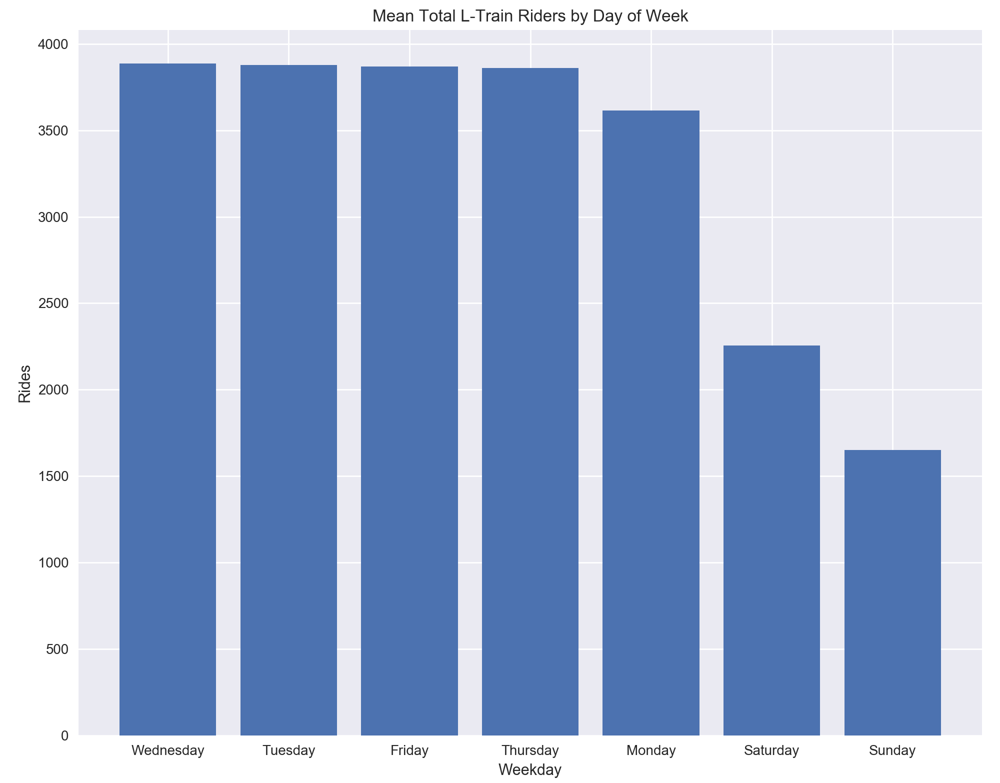
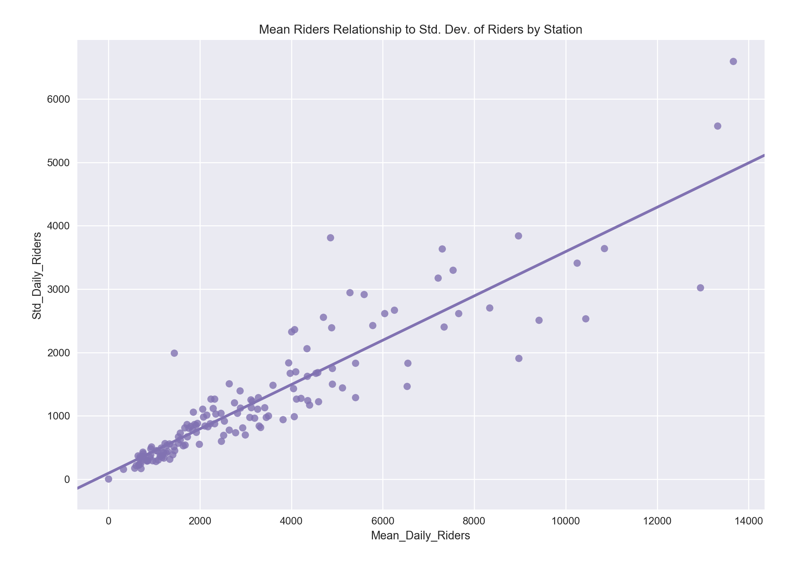
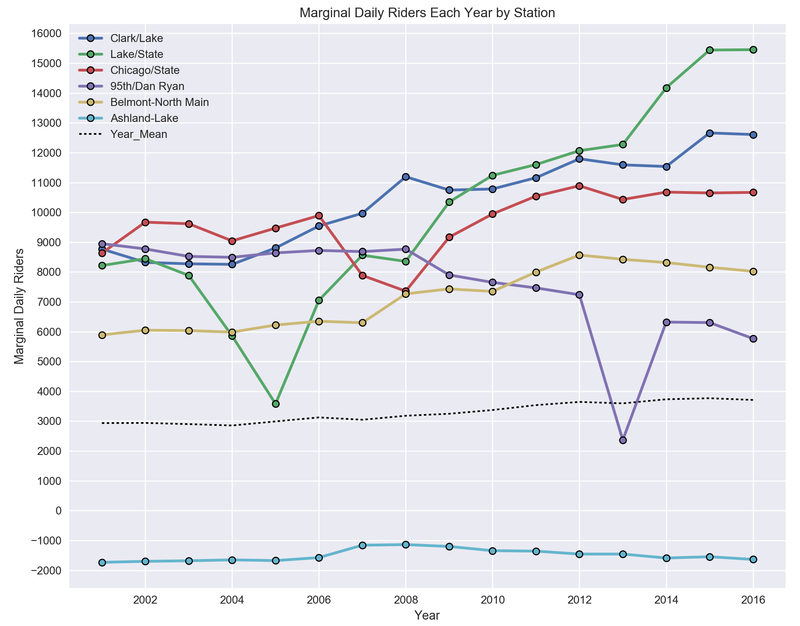
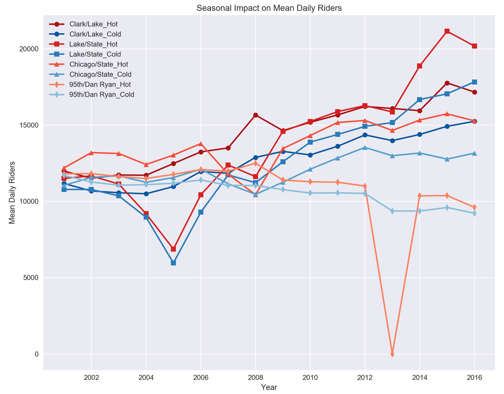
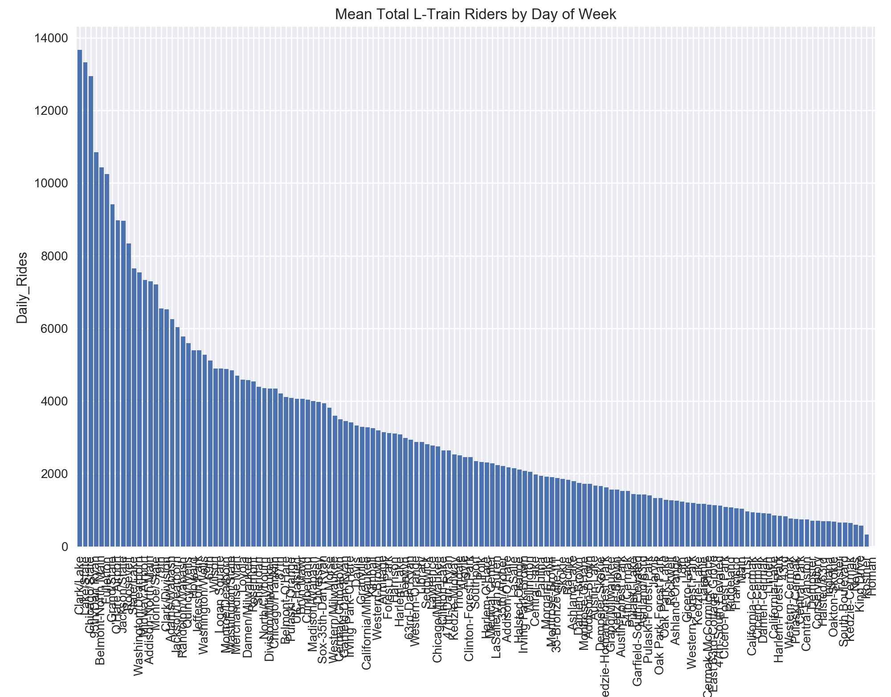

# Chicago Elevated "L" Train Questions

Please see the accompanying `jpw_chicago_L.py` file for code.

### Some Warm Up Questions to Get Started
***
1. Which stop has the highest average ridership per day, and what is it?
    + __Station:__ Clark/Lake
    + __Avg. Daily Rides:__ 13,662.78 (truncate to 13,662)
    + __Total Days of Operation:__ 5845
    + __Start Date:__ 01/01/2001             
    + __Finish Date:__ 12/31/2016

2. Which stop has the greatest standard deviation in weekday (exclude holidays) ridership per day, and what is it?
    + __Station:__ Lake/State         
    + __Std. Deviation (Riders):__ 4,302.62 (truncate to 4,302)
    + __Total Days of Operation:__ 5845
    + __Start Date:__ 01/01/2001             
    + __Finish Date:__ 12/31/2016

 

### The Business Owner Question
***
You're starting a new business and have access to this "L" train data.
1. What questions could you potentially explore/answer with this data?
2. Ideally, what other data would you gather or combine to learn even more?
3. How would you want to see data presented, to make it actionable by you or others?

As someone who comes from a family that owned and operated [a family business](https://en.wikipedia.org/wiki/Wright_Brand_Foods) for 78 years, I find this question genuinely interesting.  My great-grandfather, Roy, didn't have access to such data back in the 1920s.  He didn't even have a computer, so while the concept of using data to start a business would be foreign to him, it clearly is the best way to make smart decisions.  Of course, competitors can _also_ use this data, so being able to use it _intelligently_ is really the separator between us and our competitors.  Let's take these questions in turn.  

 

#### What questions could you potentially explore/answer with this data?
I'm happy to start a business near an "L" station as long as my experience is better than Harrison Ford's was:

 

Assuming we are opening a business that deals with in-store customers, we'd like a lot of traffic near our location so we can attract the most visitors.  So, the first thing we'd like to do is rank the stations on daily traffic.  Including weekends or holidays could be business-specific.  A sports bar is likely to prioritize heavy weekend traffic as football is played on Saturday and Sunday (though, with all apologies to Chicago natives, I'm not sure the Bears have been drawing the largest crowds in recent years!), while a bakery might be busiest on a weekday because people stop in during their hurried lunch break.  We can breakdown the riders per day of the week with a little extra work in hopes of finding the busiest days for stations.

We've also shown that we can see the variance of the number of riders per day.  In general, a higher spread suggests that the number of riders is likely to be day (or even holiday) related.  If our  deviation in daily riders is large we would also possibly be less certain of our business predictions.  For example, if we the standard deviation of riders per day was a significant portion of the mean riders per day, we might face multiple days in a row of far-below-mean riders and, as a result, take a real hit to our weekly/monthly business targets. (This, of course, assumes true stochasticity, which is certainly _not_ the case for actual ridership patterns.  Variance in daily riders still needs to be noted, but understanding the underlying trends that cause this spread is what is really important.  This is discussed in the second answer).

While the average number of riders per day is nice to know, it is also an unspecific, aggregated value in some regards.  It is surely better than having no data, but it might also be a bit like using a sledgehammer when we should use a scalpel.  We'd ideally like to know more about rider patterns. One thing that would be helpful to know is if "this station is growing or shrinking in daily use."  If a station is, say, only the 12th most frequented stop in the city, but has grown year-over-year for the last six years, then that is an encouraging sign that setting up a new business near this stop would have lifeblood going forward.  Conversely, a stop that has decreased annually might give us pause in starting a new store in this location.  

We could use the overall ranking as a good guide for this growth or shrinkage, but to properly measure this we would need to compare the number of riders per station to the overall average for each year, giving us the marginal growth or reduction per station.  If the population of Chicago is growing as a whole, then we'd expect most stops to increase, and vice versa.  So, we need to understand how each station is growing relative to the average level of growth.

Another insight we could glean from this dataset is seasonality.  Chicago is actually further north than New York City, latitudinally, making it the northern-most city with at least one million people (Seattle is much farther north but has just over half a million residents).  As a result of its latitude and proximity to the Great Lakes, Chicago endures the harshest winters of the major American cities, with both lower average annual temperatures and higher average annual snowfall than New York City (See __Appendix__). [__1__](#fn1), [__2__](#fn2)

We can use this dataset to look at the breakdown of riders overall and per station during the warmest six months and the coldest six months of the year.  As a business owner we could then calibrate our budget accordingly.  This assumes that riders via the "L" trains would be the primary means of customer influx, which is not necessarily a true assumption.  This is discussed below as well.  

 

#### Ideally, what other data would you gather or combine to learn even more?
The first additional data I'd want would be time of day.  I recognize this would require advanced logging by the CTA, but if it were available it would be very valuable.  We could then see which stations were most impacted by early morning rush hour, lunch, and end of work rush hour.  As a prospective business owner I would also be able to further respond to increased or decreased employee demand if necessary.  Learning this information could help us explain the variance in riders per day, as well as both weather and sports related data discussed below.

Another set of new data that would be important in determining where to open a business would be the relative income breakdown of the surrounding area for each station.  If I am opening a high end restaurant or fancy clothing store I'd like to skew towards a more affluent area, for example.  In a dreamworld we'd know the actual income of each rider, but then we'd be getting into sketchy territory dealing with privacy.  The only impetus behind desiring this information is the realization that the area in which each station is located is not necessarily representative of all riders for a given stop.  Still, it serves as a reliable proxy in that more people who live near a stop will use it more frequently.

Piggybacking on gathering neighborhood income information would be the next level of financial insight: what type of jobs are commonly near each stop -- what jobs are riders traveling to?  The point of learning this is that certain types of jobs pay on different days.  Entry level positions at lower-skilled professions will pay either bi-monthly (say, the 1st and the 15th) or sometimes on a certain day of the week, such as every other Friday.  Knowing this information would be valuable if we wanted to run a sale for a certain item.  Ideally we'd target the days that people are being paid on.  Again, this isn't foolproof but could help us in making an educated decision based on our type of business and our approach to making it a success.

Regarding weather, if we knew how many of our customers were "L" riders versus how many were neighborhood residents (note this is not train-specific information and would require data gathering by us, the store runners), we could also anticipate business fluctuation due to good or bad weather.  Worse weather should indicate more people riding the train instead of walking, and if a large percent of our customer base is train riders then we would be able to predict possibly more customers on these days.  If we were running a bar or restaurant, we'd know to stock up on more food and keep an extra server on duty, etc.  The reverse is also true if a majority of our customers are neighborhood residents instead of "L" passengers.

Finally, one thing that might be responsible for the greatest spike in train rides _in specific stations_ is sports.  The Bears play at Soldier Field, but that is only eight times a year, most of which are on a Sunday.  The Cubs, White Sox, Blackhawks, and Bulls have either 81 or 41 home games a season, most of which are on weekdays.  Depending on which train line their respective fields or arenas are on, we'd expect a significant spike in riders on these days for these lines.  If I was a business owner, I'd want to have all the data related to this I could possibly get.  The obvious beneficiaries are restaurants and bars, as fans will spill out into them to socialize before and after a game.  However, just due to sheer increase in people in the area, all business probably enjoy days of home games.

This additional data would allow further interaction with our existing data of train stations, riders, day of the week and date to paint a very informative and actionable picture.  No business is ever assured of success, and in fact the vast majority of them ultimately fail, but I would have much more confidence in my decision to start a new endeavor if I could use all this data to optimize my decision making strategy.

 

#### How would you want to see data presented, to make it actionable by you or others?
In general, I do well with visualizations and welcome them.  Most visualizations are best for trends and bigger picture insights, I believe.  Showing the difference between total riders per year naturally lends itself to a visualization (likely either a bar or line plot).  Showing the average riders over the last week in the same chart, while technically valid, may potentially lend itself to possible overreaction on the reader's part.  "Oh, look!  Such a massive drop from Sunday to Wednesday!"  But, in reality, this may be the expected behavior and our plot which lacks this context doesn't help us.  

In this case, what I'd really like to know is simply "is the rider count/customer count/etc. we are observing this week within the realm of normalcy or is something else afoot?"  This classification itself could be presented graphically rather easily by showing an X-% range of expected behavior and where our current observations lie relative to this.  

Advanced visualization libraries which allow interactivity seem to be a good fit for the curious or informed user, but may not be best for everyone or for presenting to higher-ups.  In those cases we'd ideally want to distill the information down to its most salient points which can help steer decisions.  On a personal level, I quite enjoy interactive visualizations, but they are time consuming to decipher and can make drawing hard conclusions rather difficult.

Last, simple raw tabular data can be very useful when making basic comparisons _so long as the table is concise and tidy_.  For example, I could make a visualization of the climate data I remarked on above, but it might actually be surprisingly difficult to convey the information in a productive way.  For example, say I made a simple bar plot of the two cities' information: latitude, mean temp, and annual snowfall.  If the y-axis was too small, the differences could appear great, with New York City's annual snowfall being at the bottom of the chart, adjacent the x-axis, and Chicago's being at the top of the chart, almost touching the title.  Visually this would make the difference between the cities look extremely large.  Conversely, a y-axis too zoomed out would make the two cities appear to have identical values.  

Both scenarios are misleading.  In reality, the point of the climate values was to show that while most people think of New York City as being a very cold, wintry city (which it is), Chicago is technically even more so.  I don't need a visualization to convey this; a simple table such as the one in the __Appendix__ does the job perfectly and prevents confusing the reader.

 

### Make Use of the Real Data
#### Riders Per Weekday

First things first, let's take a quick look at the average number of riders per day over the course of the entire dataset, for all stations.

  

__Figure 1:__ Bar chart for daily mean L-train usage.

 

Weekday   | Rides (Mean) | Rides (St. Dev.) | Coeff. of Variance
----------|--------------|------------------|-------------------
Wednesday | 3885         | 3347             | 0.86
Tuesday   | 3877         | 3339             | 0.86
Friday    | 3868         | 3398             | 0.87
Thursday  | 3859         | 3385             | 0.87
Monday    | 3614         | 3205             | 0.88
Saturday  | 2254         | 2360             | 1.04
Sunday    | 1649         | 1868             | 1.13

__Table 1:__ The breakdown of all L-train stations by day. 
 

We see that the weekdays are the most heavily traveled days and both days of the weekend are the two lowest-capacity days, with Sunday in particular being the day of lightest L-train travel.  Surprisingly, the standard deviation for any given day is undesirably high, with a minimum coefficient of variance (ratio of Std. Dev. to the mean) at 86%.  Both days of the weekend have a deviation actually above the mean.  Technically, this means the standard deviation goes _below_ zero when subtracted from the mean, and we can't have a _negative_ number of people riding a train.  

This is the consequence of using aggregated data for all train stations, where the stations with high amounts of travelers are skewing the values for the smaller stations.  On Mondays _Clark/Lake_, for example, has a minimum ridership of 984 people and maximum of 22,751. That's 23x the minimum value.  That's a huge swing!  Perhaps low values are on holidays or perhaps high values are on sporting event days?  In a sense, the standard deviation is a meaningless value when used for the entire dataset if we are only concerned with identifying specific stations for our business.  As a prospective business owner the issue with using this aggregated data alone is clear: I'm not getting any actionable information.  The reality is that different stations appear to face wildly different passenger loads on different days.  Breaking things down by station will hopefully give us more interpretable results.

If I were starting a business, my first thought is that I'd like to look at the weekday averages for _each_ station.  Given the time limit and theoretical nature of this assignment, I will forego this endeavor.  However, to get a gist of the idea, let's look at the top ten stations for daily riders -- I'd probably want to start my search with the busiest areas. (Note: see __Appendix Tables A2-A12__ for the weekday data on these top ten stations.  Putting ten grouped tables in the main body is too bulky).

###### Top 10 Busiest "L" Stations, 2001-2016
Station             | Daily Avg. Riders | Daily Std. Dev. | Coeff. of Variance
--------------------|-------------------|-----------------|-------------------
Clark/Lake          | 13,662            | 6,593           | 48.2%
Lake/State          | 13,321            | 5,572           | 41.8%
Chicago/State       | 12,945            | 3,022           | 23.3%
95th/Dan Ryan       | 10,846            | 3,640           | 33.5%
Belmont-North Main  | 10,434            | 2,534           | 24.2%
Fullerton           | 10,246            | 3,412           | 33.3%
Grand/State         | 9,413             | 2,509           | 26.6%
O'Hare Airport      | 8,973             | 1,908           | 21.2%
Jackson/State       | 8,967             | 3,841           | 42.8%
Roosevelt           | 8,334             | 2,706           | 32.4%

__Table 2:__ Busiest daily stations since 2001.

 

The results for the ten busiest stations help shed some light on our desire to understand how each station is performing.  The busiest station, _Clark/Lake_, has a standard deviation almost half of its mean daily riders.  It would be difficult to predict how reliable a customer flow for our business near this station could be if this was all the data we had.  We want to be near these high volume stations because that _should_ mean more customers, but we also want to find stations that have a consistent number of passengers so we can have consistent business.  

Looking at this table shows that _Chicago/State_ and _Belmont-North Main_ both have high total rider volumes but comparatively low variances.  This would make either of these two stations more appealing all other variables being equal (which, of course, they certainly are not).  Let's take a quick peek at how all 147 stations fair in this metric with a scatter plot and linear regression trend line.

###### How Average Number of Daily Passengers Relates to Std. Dev. of Daily Passengers

__Figure 2:__ Mean vs. Std. Dev. of daily passengers per station. 

 

We can see both _Chicago/State_ and _Belmont-North Main_ as the third and fifth data points from the right.  In general, we want to be on the right side of the plot (more riders) and below the regression line (more consistent).  These two stations fit that requirement very well while _Clark/Lake_ is nearly off the charts for its inconsistency.  The overall trend is also as expected in that a higher mean correlates with a higher standard deviation.  Again, this is only a simple cursory review of big picture trends for all stations in the elevated train system, but it would give me a first step in identifying areas to consider for my business.

#### Marginal Daily Riders
As mentioned above, as a hypothetical business owner looking to establish myself based on elevated train data, I would want to know not just whether the train station had a high or low number of passengers per day, but whether or not this number was growing or shrinking relative to the train system as a whole.  With this in mind, I calculated the marginal daily riders by year for all train stations.  Here are the marginal daily rider values for the top five most used stations overall (from __Table 2__).

__Figure 3:__ Marginal daily rider values compared to the mean of all stations by year.

 

There are a few things to note from this plot.
1. _Clark/Lake_ has the highest average number of daily riders from 2001-2016, but since 2010 it has been trailing the \#2 overall station, _Lake/State_ each year.  Further, _Lake/State_'s daily rider count has grown -- the key focus of this plot -- at a higher rate than any other station over the last four years, making it more appealing as a potential area to set up a business.  

2. _Lake/State_ and _95th/Dan Ryan_ saw massive dips in passenger numbers in 2005 and 2013, respectively.  I wonder if these stations were undergoing construction during these years?  If so, as a businessman I might consider stations that have been refurbished in recent years to be more valuable as they are likely to be nicer and to require less maintenance going forward.  This is highly speculative, but is worth noting.  Without plotting this it is unlikely we would have caught these two exceptions.  

3. Recall that _Chicago/State_ and _Belmont-North Main_ had two of the three lowest variances of the top ten most used stations (_O'Hare_ is the lowest, but I am considering setting my business inside the city and not the airport).  While variance isn't what we've plotted, here, we can see that the results fit with the general trends in ridership for each station, with _Chicago/State_ and _Belmont-North Main_ being more stable than the others.  Though, removing the two "construction" drops for _Lake/State_ and _95th/Dan Ryan_ would help evaluate their history better.  If I am going to risk larger inconsistency from the station I build my business close to, I want the station's popularity to at least be trending in the correct direction.  Thus, _Lake/State_ appears to be more worthy of a risk than does _95th/Dan Ryan_ which has been on a downward slide for a decade.

4. The "L" train system appears to be gradually growing in use with time, up from under 3,000 daily riders per station in 2001 to nearly 4,000 in 2016.  There is a physical limit to the capacity of each train, and while I don't know what it is, I suspect the most used trains are all probably near or at capacity during rush hours.

When considering which train station I might want to base my business near, using this data would prove highly desirable and invaluable.  Granted this is only a passing glance at the surface of train usage, it still provides real insight into the underlying life of a station and would warrant deeper investigation.

 

#### Seasonal Trends
Another variable to inspect is how seasonality affects train travel.  The thinking is that warmer temperatures promote more walking while colder temperatures lead to more train riding.  Since this is a small theoretical project, let's take a look at only the five busiest train stations since they have the greatest number of riders which might opt for a walk over a train ride.  (Note one major flaw with this is that there are multiple other variables, such as purpose of riding the train to begin with and what type of neighborhood the station is in, which also impact whether someone walks or rides.  But it will serve as a fair first look).  

In the interest of brevity I will group every year into two sub-groups, the warmest four months and the coldest four months.  The warmest four months happen to be June through September, while the coldest are December through March. [__1__](#fn1)  Then we will see the mean rider counts by year for these two sub-groups for the busiest stations.  

###### Seasonal Ride Fluctuation

 __Figure 4:__ Impact of seasonal temperatures on mean daily riders for the three busiest stations 

This chart can be a little busy, but focusing on the different marker shapes for each line helps distinguish the stations.  Much to my personal surprise, I was dead wrong.  More people ride the elevated trains during the summer months than winter months!  One possible explanation is simply that more people go out in the city during the warmer months and will need to take the "L" as transportation.  

Winters in Chicago can be brutal and so apparently people simply choose to not go out when they don't have to.  My assumption that more people walked during summer months might technically be true, but that is outweighed by the fact that the sheer number of people that go out during warm months causes train usage to increase.  Note that _95th/Dan Ryan_ had __zero__ riders in the summer of 2013, which will skew its averages below.  I assume the station was under construction for the summer but reopened by winter.

Let's see the differences between the two seasons numerically.

###### Five Busiest Stations by Season
Station            | Mean Daily Riders (Hot) | Mean Daily Riders (Cold) | Increase for Hot Months
-------------------|-------------------------|--------------------------|------------------------
Clark/Lake         | 14,401                  | 12,707                   | +1,694
Lake/State         | 13,924                  | 12,594                   | +1,330
Chicago/State      | 13,697                  | 12,036                   | +1,660
95th/Dan Ryan      | 10,645                  | 10,606                   | +39
Belmont-North Main | 11,006                  | 9,595                    | +1,330

__Table 3:__ Comparison of summer vs. winter months for the busiest stations. 

 

First, these numbers show what we see in __Figure 4__ above: more people ride the "L" in the summer than the winter.  The asterisk is _95th/Dan Ryan_ which we saw was out of commission for the summer of 2013.  Despite this, it has _still_ had more riders in summer months than winter months overall since 2001.  

Second, as a potential business owner, knowing these trends would help me plan my staffing, my stock, my advertising, and my budget for a given station's area.  I could use these seasonal values as a proxy for expected increase or decrease in business overall.  Public transport is the vascular system of any city, and as we've seen in this theoretical business research project, we can learn a lot about how the lifeblood that is the citizenry of a city really flows.  

Of course, none of this guarantees any success as a business owner, but it serves as a great starting point to provide actionable insights into what I could do as a business owner to set myself up for the best shot at success.  We've been able to identify which stations have the most riders, which ones are growing or shrinking in their use, and how much the season affects their popularity as well.  Further investigation and additional data could really help tease out important points about each station well beyond the scope of this one-day-long project.  

 
 

#### References
<a name='fn1'>1.</a> https://en.wikipedia.org/wiki/Climate_of_Chicago  
<a name='fn1'>2.</a> https://en.wikipedia.org/wiki/New_York_City#Climate

 
 

#### Appendix
__Table A1:__ Chicago v. NYC Climates

City           | Latitude | Annual Daily Mean Temp (°F) | Annual Snowfall (in.)
---------------|----------|:---------------------------:|:--------------------:|
Chicago        | 41°50 N  | 48.1                        | 30.5
New York City  | 40°42 N  | 55.0                        | 25.8

 
 

__Tables A2-A12:__ The Top 10 Most Used Stations by Daily Riders

__Clark/Lake:__

Weekday   |  Rides  | Std. Dev.
----------|---------|----------
Wednesday | 17838.9 | 2822.14
Tuesday   | 17806.3 | 2826.69
Thursday  | 17608.9 | 3591.41
Friday    | 17050.1 |  3339.1
Monday    | 16483.1 | 4165.99
Saturday  |  4987.8 | 1874.99
Sunday    |  3864.1 | 1596.69

__Lake/State:__

Weekday   |  Rides  | Std. Dev.
----------|---------|----------                    
Friday    | 15830.0 | 4709.46
Wednesday | 15828.8 |  4291.1
Tuesday   | 15700.7 | 4275.99
Thursday  | 15668.8 | 4630.34
Monday    | 14624.5 | 4548.52
Saturday  |  9266.4 | 4077.51
Sunday    |  6338.6 | 3038.23

__Chicago/State:__

Weekday   |  Rides  | Std. Dev.
----------|---------|----------                        
Friday    | 15142.4 | 2039.83
Thursday  | 14022.6 | 2207.26
Tuesday   | 13980.6 | 1748.86
Wednesday | 13894.6 | 1662.51
Monday    | 12994.6 | 1950.75
Saturday  | 12130.2 | 3250.37
Sunday    |  8444.9 | 2428.46

__95th/Dan Ryan:__

Weekday   |  Rides  | Std. Dev.
----------|---------|----------                        
Wednesday | 12822.5 |  2525.8
Tuesday   | 12813.2 | 2544.44
Friday    | 12640.6 | 2546.63
Thursday  | 12588.6 | 2729.15
Monday    | 12015.1 | 2894.58
Saturday  |  7461.8 | 1382.57
Sunday    |  5576.7 | 1054.51

__Belmont-North Main:__

Weekday   |  Rides  | Std. Dev.
----------|---------|----------                        
Friday    | 11834.4 | 2109.83
Thursday  | 11231.6 | 2177.14
Wednesday | 11148.2 | 1731.73
Tuesday   | 11014.9 | 1682.92
Monday    | 10309.4 |  1855.2
Saturday  |  9926.5 | 2184.15
Sunday    |  7570.6 | 3138.28

__Fullerton:__

Weekday   |  Rides  | Std. Dev.
----------|---------|----------                 
Wednesday | 11918.9 |  2807.4
Tuesday   | 11908.0 |  2681.5
Thursday  | 11866.1 | 3134.56
Friday    | 11265.1 | 2456.99
Monday    | 10984.8 | 2901.92
Saturday  |  7959.2 | 2148.06
Sunday    |  5817.6 | 1727.19

__Grand/State:__

Weekday   |  Rides  | Std. Dev.
----------|---------|----------                      
Friday    | 11198.5 |   2228.62
Thursday  | 9865.6  | 1955.51
Wednesday | 9791.4  | 1658.97
Tuesday   | 9601.0  | 1627.12
Saturday  | 9399.9  | 3233.44
Monday    | 9143.2  | 1694.99
Sunday    | 6894.0  | 2573.53

__O'Hare Airport:__

Weekday   |  Rides  | Std. Dev.
----------|---------|----------                        
Friday    | 10502.4 | 2121.21
Monday    |  9616.6 | 1525.82
Thursday  |  9559.9 |  1867.1
Wednesday |  8658.4 | 1483.42
Tuesday   |  8634.7 | 1430.47
Sunday    |  8262.1 |  1677.8
Saturday  |  7576.9 | 1542.67

__Jackson/State:__

Weekday   |  Rides  | Std. Dev.
----------|---------|----------                         
Tuesday   | 11577.5 | 2037.38
Wednesday | 11476.3 | 2023.13
Thursday  | 11255.2 | 2413.14
Monday    | 10622.9 | 2648.87
Friday    |  9860.6 | 1892.38
Saturday  |  4678.7 | 1718.92
Sunday    |  3330.3 | 1897.14

__Roosevelt:__

Weekday   |  Rides  | Std. Dev.
----------|---------|----------                         
Friday    | 9443.0 | 2675.28
Thursday  | 9034.3 | 2518.01
Wednesday | 9003.6 | 2193.17
Tuesday   | 8919.4 | 2237.97
Monday    | 8502.9 |  2355.4
Saturday  | 7344.8 |  2699.9
Sunday    | 6100.0 | 2578.04

__Figure A1:__ All stations daily average riders.

This shows the logarithmic decline of daily usage by station for the L-trains in Chicago.  I bet we could find a direct relationship between distance from a certain spot in the city/city center and decrease in riders.  "Homan" has less than _one_ rider per day.  Going to chalk that up to data entry error?  But worth looking into.  Might be worth closing down if so.
